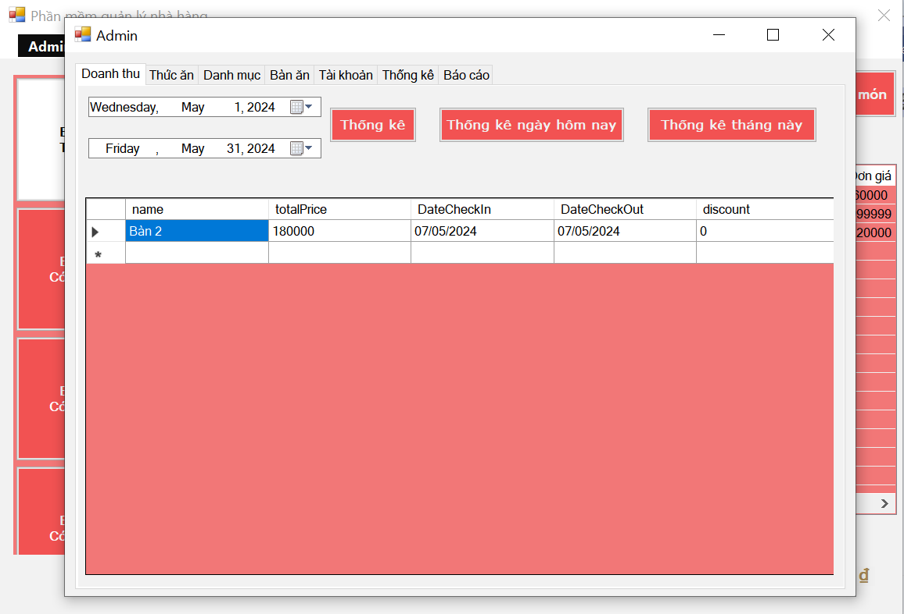

# Restaurant Management
 
A desktop application developed to assist in the management of business operations for restaurants, eateries, cafes, and similar culinary establishments. Helps users easily manage menu items, table reservations, bill management, and track revenue effectively.

## Technologies Used:

- **Programming Language:** The application is developed using C#.
- **User Interface:** Windows Forms (WinForms) is used to build a user-friendly and easy-to-use interface.
- **Development Model:** The application adheres to the 3-tier architecture model to separate the application logic into distinct layers: the presentation layer (WinForms), the business logic layer (BLL), and the data access layer (DAL).
- **Singleton Pattern:** Singleton Pattern is utilized to create a single instance of the DataProvider class, optimizing access and usage of data from the database.

## Key Features:
- **Menu Management:** Allows users to add, edit, and delete items from the menu list, including item names, prices, and categories.
- **Table Reservation and Management:** Users can reserve tables for customers and manage the status of tables, including available and occupied tables.
- **Bill Management:** Supports the creation and management of payment bills for customer orders, including adding, deleting, and modifying items within the bill.
- **Reporting:** Provides reporting functionality to generate reports on various aspects of restaurant operations, such as sales, revenue, and popular menu items.

## Utilized Technologies:
- C#
- Windows Forms (WinForms)
- 3-tier Architecture
- Singleton Pattern

## Images and Report

### Report
[Download BaoCao_QuanLyNhaHang.pdf](BaoCao_QuanLyNhaHang.pdf)

